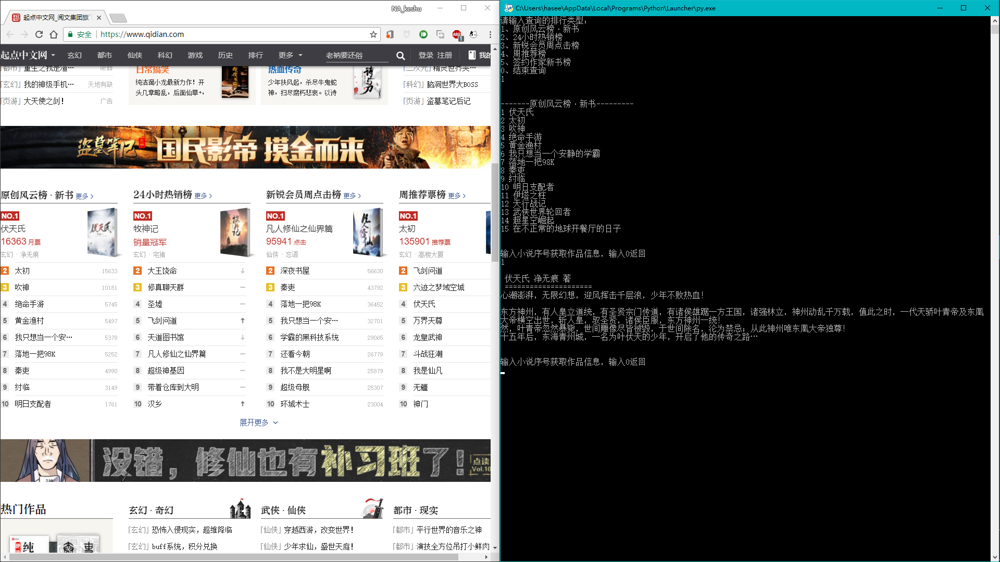

getRanksofQidanNovels
=======

爬取[起点中文网](https://www.qidian.com)五个热门排行榜，并查询其中小说的简介

+ 使用语言：python3
+ 使用第三方库：requests库、beautifulsoup4库

## 运行截图


## 使用方法
```
克隆仓库，下载代码
git clone 
安装第三方库
pip install requests
pip install beautifulsoup4
启动程序
python crawingRanksofQidianNovels.py
```

*有时间把代码优化一下*